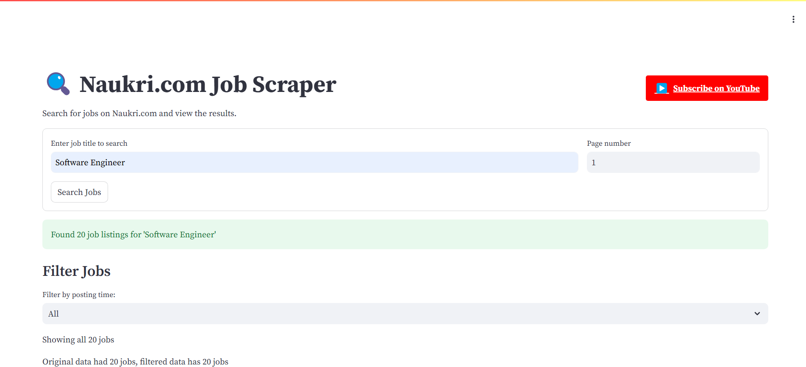

# 🔍 Naukri.com Job Scraper

<div align="center">


[](https://www.youtube.com/@Pawankumar-py4tk)


**A powerful web application for searching and filtering job listings from Naukri.com**

[Features](#-features) • 
[Demo](#-demo) • 
[Installation](#-installation) • 
[Usage](#-usage) • 
[Project Structure](#-project-structure) • 
[How It Works](#-how-it-works) • 
[Connect](#-connect-with-me)

</div>

## ✨ Features

<div align="center">
  
</div>

- 🔍 **Search by Job Title:** Find relevant jobs by keyword or title
- 📊 **Filtering Options:** Filter jobs by posting date (Today, Yesterday, This Week, etc.)
- 📑 **Detailed Information:** View comprehensive job details including:
  - Company name and logo
  - Required experience
  - Location
  - Salary information
  - Posted date
  - Complete job description
- 💾 **Export Results:** Download job search results as CSV files
- 🖥️ **User-friendly Interface:** Clean, responsive Streamlit web application
- 🔄 **Pagination Support:** Navigate through multiple pages of job listings

## 📋 Demo



*Above: Screenshot of the Naukri.com Job Scraper interface with search results*

## 📦 Installation

<div align="center">
  
</div>

1. **Clone this repository**
   ```
   git clone https://github.com/yourusername/naukri-job-scraper.git
   cd naukri-job-scraper
   ```

2. **Create a virtual environment (recommended)**
   ```
   python -m venv venv
   source venv/bin/activate  # On Windows: venv\Scripts\activate
   ```

3. **Install required dependencies**
   ```
   pip install streamlit pandas requests
   ```

## 🚀 Usage

1. **Run the Streamlit application**
   ```
   streamlit run streamlit.py
   ```

2. **Using the web interface:**
   - Enter a job title in the search box
   - Set the page number (default is 1)
   - Click "Search Jobs" to fetch listings
   - Use the filter dropdown to narrow results by posting date
   - Expand job listings to view full details
   - Click "Download filtered results as CSV" to export data

3. **Using the Python script directly:**
   ```
   cd NaukriWebScrapper
   python SCRAPPER.py
   ```
   Follow the prompts to enter a job title and page number.

## 📁 Project Structure

```
naukri/
├── streamlit.py          # Main Streamlit web application
├── style.py              # CSS styles for the web interface
├── NaukriWebScrapper/
│   ├── SCRAPPER.py       # Command-line scraper script
│   ├── headers.py        # HTTP headers for requests
│   ├── cookies.py        # HTTP cookies for requests
│   └── README.md         # Original scraper documentation
├── 1.png                 # Screenshot images
├── 2.png
└── 3.png
```

## ⚙️ How It Works

<div align="center">
  
</div>

1. **Job Search Request:**
   - The application constructs a URL to search Naukri.com based on your job title
   - It uses specific headers and cookies to mimic a real browser request

2. **Data Processing:**
   - Job listings are parsed from the JSON response
   - Each listing is categorized by posting time (Today, Yesterday, This Week, etc.)
   - The data is transformed into a pandas DataFrame for easy manipulation

3. **User Interface:**
   - Streamlit creates a responsive web interface
   - Users can filter jobs by posting time
   - Each job listing can be expanded to show full details
   - Results can be downloaded as CSV files

## 🔧 Requirements

- Python 3.6+
- Streamlit
- Pandas
- Requests

## 🔗 Connect With Me

<div align="center">
  <a href="https://www.youtube.com/@Pawankumar-py4tk">
    
  </a>
</div>

<div align="center">
  <p><b>Subscribe to my YouTube channel for more Python tutorials!</b></p>
  <a href="https://www.youtube.com/@Pawankumar-py4tk">
    
  </a>
</div>

## 📝 License

This project is available under the MIT License.

---

<div align="center">
  <p>Developed with ❤️ by <a href="https://www.youtube.com/@Pawankumar-py4tk">Pawan Kumar</a></p>
  <p>© 2023 All Rights Reserved</p>
  
  
</div>
